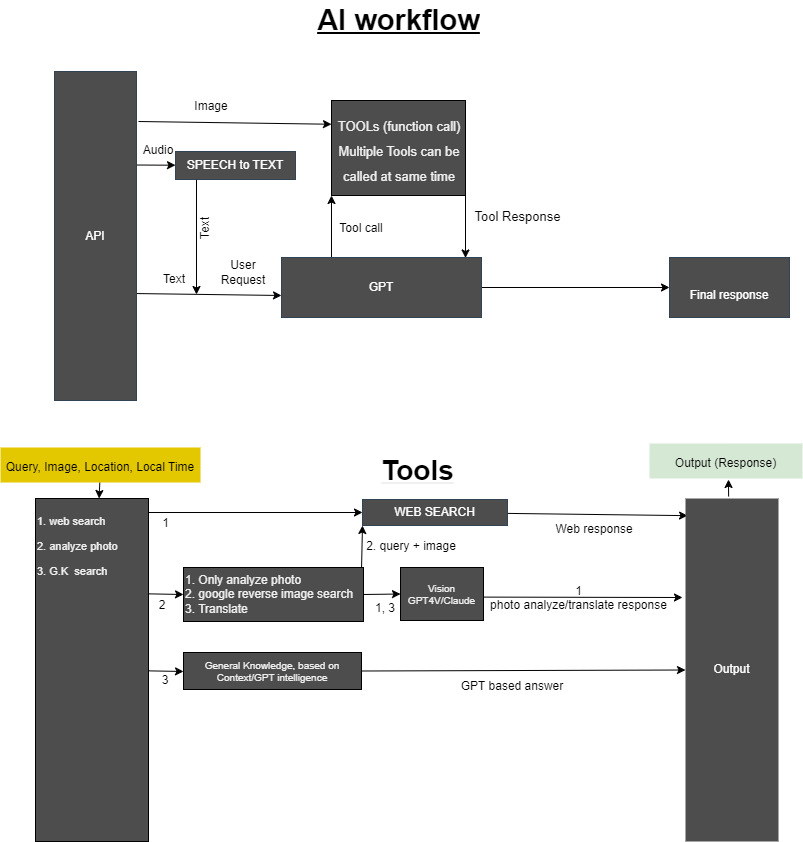

# Noa Assistant
 This repository conatains all AI stuff of Noa that can be used in parallel with\
 a Authentication server to protect APIs and throttled usage\
Working features:
1. Conversational AI
2. Coversation with Photos
3. Input from Audio
4. Websearch

### Setup
1. copy the `.env.example` file to `.env` and fill in the keys
Note: for reverse image search a image cdn needed, you can use any api which accepts image and returns a url.\
format of the api should be like this.\
Or this can be avoided if not using reverse image search
```sh
curl -F'file=@path/to/yourfile.png' -Fexpires=2 example.com
```

1. Create and activate a python virtual enviroment(optional). eg. from [freecodecamp](https://www.freecodecamp.org/news/how-to-setup-virtual-environments-in-python/)

2. Install [ffmpeg](https://ffmpeg.org/download.html), and make sure its available in PATH variable
3. Install required python packages
```bash
pip install -r requirements.txt
```
4. Run the server
```bash
python app.py --server
```
vision tools, search tools, assistant can be selected by passing the following arguments
```bash
python app.py --server --vision gpt-4-vision-preview --search-api serpapi --assistant gpt
```

Now the server should be running on `http://localhost:8000` if default port is used
### API
#### POST /mm
```javascript
await fetch('localhost:8000/mm', {
  method: 'POST',
  body: new FormData({
    mm: JSON.stringify({
      prompt: 'who are you?',
      messages: [
        {
            role: 'user',
            content: 'Hi'
        },
        {
            role: 'assistant',
            content: 'Hello how can I help you?'
        }
      ],
      gps: [23.646965, 87.159115],
      local_time: 'Tuesday, March 12, 2024, 7:24 AM',
      address: 'london',
      vision: 'claude-3-haiku-20240307'
    }),
    image: new File(['path/to/yourfile.png'], 'yourfile.png'),
    audio: new File(['path/to/yourfile.wav'], 'yourfile.wav')
  })
})
```
#### POST /health
```javascript
await fetch('localhost:8000/health')
```
### workflow

